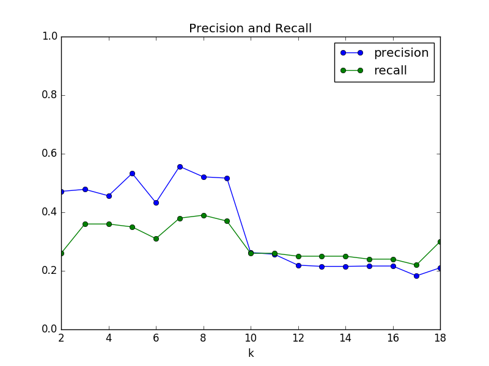

# Identifying Fraud From Enron Emails and Financial Data

**Isabel María Villalba Jiménez**

June 16, 2017

##Project Overview

The goal of this project is to be able to detect people committing fraude using a vast dataset of emails between employees of ENRON.  

Enron Corporation was an American company based in Houston, Texas and founded in 1985. Before its bankruptcy on December, 2001, Enron had 20,000 employees and was one of the world's major electricity, natural gas, communications and pulp and paper companies, with claimed revenues of nearly $101 billion during 2000.

At the end of 2001, the  **Enron scandal** emerged, being revealed that the reported financial condition was false and it was sustained by institutionalized, systematic, and creatively planned accounting fraud. 

Enron has since become a well-known example of willful corporate fraud and corruption. The scandal brought into question the accounting practices and activities of many corporations in the United States and was a factor in the enactment of the Sarbanes–Oxley Act of 2002 [[Source]](https://en.wikipedia.org/wiki/Enron).


##1. Dataset and Outliers
The dataset has a total of **146 people** entries with **21 features** each. From the people there are **18 POIs** and **128 Non POIs**.

The total number of `NaN` appearing per variable is:

loan_advances                142
director_fees                129
restricted_stock_deferred    128
deferral_payments            107
deferred_income               97
long_term_incentive           80
bonus                         64
from_this_person_to_poi       60
from_poi_to_this_person       60
from_messages                 60
shared_receipt_with_poi       60
to_messages                   60
other                         53
expenses                      51
salary                        51
exercised_stock_options       44
restricted_stock              36
email_address                 35
total_payments                21
total_stock_value             20
poi                            0

It can be seen that the three variables with the highest amount of missing data are: loan advances, director fees and restricted stock deferred.

After making exploratory analysis I found the following information abouth these entries:

* ``TOTAL``:  has many outliers with extreme values. It seems to be an artifact of a spreadsheet after summing all values for each row.
* ```THE TRAVEL AGENCY IN THE PARK```: is not representative of an individual
* ```LOCKHART EUGENE E```: has all NaN values.


##2. Features Selection and Scaling
## What features did you end up using in your POI identifier, and what selection process did you use to pick them? Did you have to do any scaling? Why or why not? 

In order to complement the 21 features, I created 4 additional features to complement them and have better predictions.

* `fraction_from_poi`: fraction of emails received from POIs. If somebody receives many emails from a POI may be a POI himself/herself.
* `fraction_to_poi`: fraction of emails sent to POIs. The same reason as in the previous bullet: sending a lot of emails to a POI may indicate that that person is a POI.
* `fraction_poi_total`: fraction of emails related to POIs. Proportion of messages are between POIs compared to overall messages. This feature allows to know what ratio of the communication of a person is with a POI. People with high rates of comunication with a POI may be POIs.
* `wealth`: salary, total stock value, exercised stock options and bonuses. Abnormal amount of money may indicate that the person is taking advantage of the company and that he/she is a POI.

I used scikit-learn SelectKBest to select the most influential features and used those features for all the upcoming algorithms.
As this datset is quite imbalanced (the number of elements of one class is different from the other), the accuracy is not a good metric to use for selecting parameters.

In this case it will be used the **precision** which is defined as the number of true positives ($T_p$) over the number of true positives plus the number of false positives ($F_p$) and the **recall**, that is defined as the number of true positives ($T_p$) over the number of true positives plus the number of false negatives ($F_n$).

For this dataset the precision is shows the proportion of POIs succesfully identified and the recall shows the proportion of individuals amont the identified as POIs that are truly POIs. THe algorithm tested for the parameters selection will be Gaussian Naïve Bayes since, apart from being the one used for this project, it is generic algorithm. 




The value for k select will be 7, that is the one that has best combination of precision and recall. This is the rank returned by ```SelectKBest``` showing the importance of each variable of the dataset:

| Features                      | Scores   | 
| ----------------------------- |:--------:| 
| Exercised Stock Options       |  25.1| 
| Total Stock Value             | 24.47   |  
| Bonus                         | 21.06  |
| Salary			|  18.58  |
| Fraction to POI		| 16.64 |
| Wealth 					  | 15.55  |
| Deferred Income				  | 11.6   |


It seems that knowing how deep you involved into Stocks and how much money you receive from Bonuses and Salary are ones of the most imporant features to tell whether you can be a POI or not. Also quite important, the fraction of communication sent to POI.

**Features Scaling :**  Before passing the data to the classifiers to train, we must normalized them. It is used to standardize the range of features in the data. In this case, I have used a common scaller from Scikit-learn named ```MinMaxScaler()``` which sets the data to the range 0-1 [[Reference]](http://scikit-learn.org/stable/modules/generated/sklearn.preprocessing.MinMaxScaler.html).

##3. Parameters Tuning

Parameter tuning is the process of adjusting the parameters of an algorithm to improve its performanc when predicting for new data. Parameters are important to design an algorithm that allows to predict as accurately as posible where being able to generalize as much as posible. There is a subtle line in which we must decide how much we want to predict accurately or we want to generalize. In the extreme, an algorithm with high scores when predicting may have a good performance with new data (overfitting) and vice versa, parameters with a stable performance for new data may be not good at learning from the available data (underfitting).

Had we decided to select the parameters using the score obtained on the training data we could be incurring in overfitting and hence, not being able to generalize well, and the performance with unknown data would be poor.


In order to evaluate the performance of an algorithm a metric must be chosen.
Since the dataset is quite imbalanced in terms of POIs vs non-POIs, **accuracy** is not a good metric. In this case it is better to use  **precision** and **recall** instead.

I tried to find a combination of parameters maximizing the precision and recall.

I tested three different algorithms, performing a `scikit-learn` `GridSearchCV` parameter optimization on each of them:


###GaussianNB: 
**parameters** used in GridSearchCV: no parameters are required 
........
Precision: 0.421051587302
Recall: 0.35271031746

##DecisionTree: 
**parameters** : 
 parameters used in GridSearchCV:
```
{'criterion': ['gini', 'entropy'],
               'min_samples_split': [2, 5, 10],
               'max_depth': [None, 1,2, 5],
               'min_samples_leaf': [1, 5, 10],
               'max_leaf_nodes': [None, 5, 10]} ```
..........
Precision: 0.195115079365
Recall: 0.163666666667
criterion='entropy', 
max_depth=None, 
max_leaf_nodes=None, 
min_samples_leaf=10, 
min_samples_split=2, 


##AdaBoost:
**parameters** : 
 parameters used in GridSearchCV:
```
 {'n_estimators': [2, 5, 10],
               'algorithm': ['SAMME', 'SAMME.R'],
               'learning_rate': [.5,.8, 1, 1.2]}```

..........
Precision: 0.325694444444
Recall: 0.160202380952
algorithm='SAMME', 
learning_rate=0.5, 
n_estimators=5, 


The best behavior is shown by the GaussianNB classifier, with better recall and precision than the others.

Gaussian Naïve Bayes, shows a better **recall** (i.e. the proportion of individuals identified as POIs, who actually are POIs) compared to other algorithms, at a slight expense of **precision** (i.e. proportion of POIs who have successfully been identified).

##4. Validation
Finally, the classifier performance is tested against a subset of data separated from the training data.  This way, we can predict how the algorithm will perform against new data in the future, and tune other parameters in consequence. The final step will be to test the algorithm with real data after performing the validation.

For the validation it will be used the `StratifiedShuffleSplit` method from Scikit-Learn. This method splits the data in K different folds, alowing to perform the training and validation data K times and have an estimate of the perfomance [[source]](http://scikit-learn.org/stable/modules/generated/sklearn.model_selection.StratifiedShuffleSplit.html#sklearn.model_selection.StratifiedShuffleSplit).  The use of a stratified shuffle split method allows to keep the imbalance of classes present in the original dataset. This model is quite suitable for the ENRON dataset, since the POIs - non-POIs classes are unbalanced.

Cross validation methods are quite used when the amount of data available is restricted and we need to make use of all the data.

The validation of the algorithm was made using 20 randomized trials and returned the mean value of the performance metrics selected:

```
Average precision: 0.56 
Average recall: 0.38 
```


#5 Test

The performance of the algorithm after running the test has been:                                         

```
Precision: 0.42
Recall: 0.35
```                                              
With a **precision** score of 0.42, it tells us that if this model predicts 100 POIs, then the chance would be 36 people who are truely POIs and the rest 58 are innocent. On the other hand, with a **recall** score of 0.35, this model can find 35% of all real POIs by making a prediction. As I commented before, due to the imbalance of the dataset, the accuracy is not a good measurement. High accuracy for this dataset can be achieved, for example, just by flagging all people as non-POI since the amount of POI is quite reduced when compared to non-POIs.
  
#Sources

- [ENRON @ Wikipedia](https://en.wikipedia.org/wiki/Enron)
- [MinMaxScaler @ scikit-learn.org](http://scikit-learn.org/stable/modules/generated/sklearn.preprocessing.MinMaxScaler.html)
- [Precision and recall @ scikit-learn.org](http://scikit-learn.org/stable/auto_examples/model_selection/plot_precision_recall.html)
- [StratifiedShuffleSplit @ scikit-learn.org](http://scikit-learn.org/stable/modules/generated/sklearn.model_selection.StratifiedShuffleSplit.html#sklearn.model_selection.StratifiedShuffleSplit)
- [Identifying Fraud from Enron Emails and Financial Data by Philip Seifi](https://github.com/seifip/udacity-data-analyst-nanodegree/tree/master/P5%20-%20Identifying%20Fraud%20from%20Enron%20Emails%20and%20Financial%20Data)
- [Identifying Fraud from Enron Emails and Financial Data by Pratyush Kumar](https://github.com/pratyush19/Udacity-Data-Analyst-Nanodegree/tree/master/P5-Identifying-Fraud-From-Enron-Emails-and-Financial-Data)

